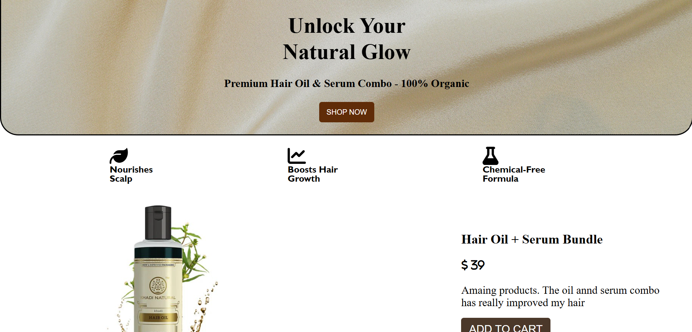

## ✨ Unlock Your Natural Glow – Hair Oil & Serum Bundle Website

A premium, responsive frontend website promoting an organic **Hair Oil & Serum Combo**. Designed with modern UI, clean code, and a smooth user experience, this site effectively showcases a natural beauty product offering.



---

# 🖼️ Demo

🔗 👉 [Click here to visit the site](https://Prateeksri1308.github.io/frontend-html-oil-web/)

---

# 💡 Features

✅ Responsive design (mobile + desktop)  
✅ Clean and elegant UI/UX  
✅ Product-focused layout  
✅ Clear CTA button (Shop Now / Add to Cart)  
✅ Highlighted benefits (scalp nourishment, hair growth, chemical-free)  
✅ Lightweight and fast

---

# 📁 Project Structure

frontend-html-oil-web /
├── index.html # Main HTML file
├── style.css # All styles
└── images/ # Images and icons


---

 # 🧰 Tech Stack

- **HTML5** – For page structure and semantics  
- **CSS3** – For layout, typography, icons, and responsiveness  
- *(No JavaScript, No Frameworks)*

---

# 🛠️ How to Use

 ▶️ View Locally

1. Download or clone the repo:
```bash
git clone https://github.com/Prateek1308/frontend-html-oil-web.git

----

# 🙋 Author
Prateek Srivastava
📚 BCA Student @ UPES
💻 GitHub: @Prateeksri1308

---

# 📄 License
This project is open-source and free to use for personal and learning purposes.
----

# 💬 Suggestions Welcome!
Have ideas or feedback to improve this?
Feel free to fork this repo or create a pull request!


---

Let me know when you add JavaScript — I’ll update this README with interactivity details like cart, scroll effects, or APIs.

Would you like me to:
- Help you deploy this now?
- Generate a `.zip` of project folders for upload?
- Create a **custom hero banner** or **animated CSS button**?

Just say the word!
